# Echo Example

This example demonstrates each type of input and output parameter and 
how they can be used to gather and display a rich set of data
* [Working with Files](#1-files)
* [Input Controls](#2-input)
    * [Simple Inputs](#21-simple-inputs)
    * [Nested Object](#22-nested-object-inputs)
    * [Arrays](#23-array-inputs)
* [Output Controls](#3-output)
    * [Simple Output](#31-simple-inputs)
    * [Nested Object](#32-nested-object-inputs)
    * [Arrays](#33-array-inputs)

##### YAML

First an aside about YAML - Each of the JSON metadata fields (`com.envoyai.schema-in`,`com.envoyai.schema-out`,`com.envoyai.info`)
can be specified with JSON, or with YAML (a superset of JSON that allows us to drop a lot of the cumbersome symbols).
An important "gotcha" when using YAML in a Dockerfile LABEL is that, because the way they caputre strings, each LABEL must have
explicit newline characters using `\n` at the end of each line. See test/echo's [Dockerfile](Dockerfile) for examples.

## 1 Files

About working with files - Accepting files as input and writing files as output is very simple on our platform.
Despite the fact that the 'EnvoyAI Integration API' can run over WebApi where files need to be transcoded to and from
strings. Files, however can be read and written normally, and any concern about transmission overhead is managed by 
the 'EnvoyAI Platform'. As a simple demonstration, the code below reads an image and modifies it by adding text. 
The input file `/envoyai/input/image.png` can be read normally, and the `image.png` property of the output will 
automatically assume the value of the file written to `/envoyai/input/image.png`.
```python
from PIL import Image, ImageDraw, ImageFont

image = Image.open('/envoyai/input/image.png')
draw  = ImageDraw.Draw(image)
font  = ImageFont.truetype('arial.ttf', 20, encoding='unic')
draw.text( (10,10), 'Your Text', fill='#a00000', font=font)
image.save('/envoyai/output/image.png','PNG')
```

## 2 Input

In practice, all inputs defined by your algorithm `com.envoyai.schema-in` will be supplied via JSON over WebApi via the 
'EnvoyAI Integration API'.  One should not be concerned with the exact user interface presentation, as it may need to vary 
system-to-system, or client-to-client. However for testing and demonstration purposes use
[portal.envoyai.com](https://portal.envoyai.com), where we dynamically render input controls for any input type.

### 2.1 Simple Inputs

#### 2.1.1 Reference Table

|Type       |In Code              |JSON Schema Property                                                                                                         |Screenshot                                     |
|-----------|---------------------|-----------------------------------------------------------------------------------------------------------------------------|-----------------------------------------------|
|String     |`string`             |`test-string: {type: 'string'}`                    |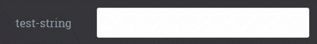        |
|Enum       |`string`             |`test-enum: {'enum': ['A', 'B', 'C']}`             |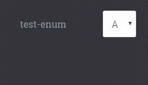            |
|DateTime   |`string` in ISO-8601 |`test-date: {type: 'date-time'}`                   |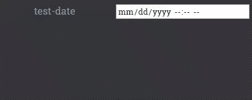    |
|Boolean    |`True` &#124; `False`|`test-bool: {type: 'boolean'}`                     |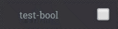      |
|Integer    |`string`             |`test-integer: {type: 'integer'}`                  |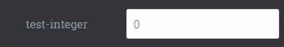      |
|Float      |`string`             |`test-float: {type: 'number'}`                     |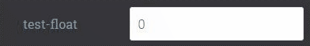          |
|Percentage |`string` ex. `12%`   |`test-percentage: {type: 'percentage'}`            |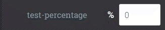|
|File       |`byte[]`             |`test.zip: {mime-type: 'application/octet-stream'}`|            |
|Image      |`byte[]`             |`test.jpg: {mime-type: 'image/jpg'}`               |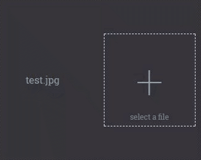          |
|Dicom      |`byte[]`             |`test.jpg: {mime-type: 'image/dcm'}`               |          |

#### 2.1.2 Reading values
Reading any of the above inputs from the provided files in the `/envoyai/input/` directory is straightforward. For example:
```python
with open('/envoyai/input/test-string','r') as file_in:
    test_string = file_in.read()
```
when using DateTime, Boolean, Integer, Float or Percentage the transformation step to convert the string into the
correct data type should be trivial in any programming language. Some example code:
```python
from dateutil import parser as dateutil_parser

# parsing examples
test_date = dateutil_parser.parse('2017-05-27T03:40:40Z') # date-times will be in ISO-8601 format
test_bool = 'False' == 'True' # booleans will either be 'True' or 'False'
test_integer = int('1')
test_float = float('3.1415926')
test_percentage_float = float("85%".replace('%', ''))/100.0 # remember to remove the percent sign
```

### 2.2 Nested Object Inputs

#### 2.2.1 Nested Object Input Controls

Nested objects can be used to organize properties - The input controls will be grouped together.

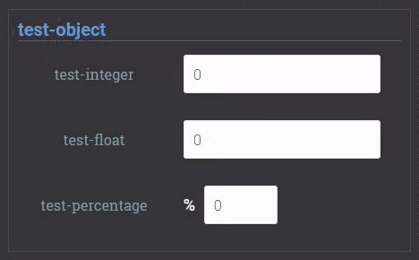

#### 2.2.2 Reading Nested Object Input Data

Data from a nested object input is available in a sub-directory. The values of the nested properties of `test-object`: 
* `test-integer`
* `test-float`
* `test-percentage`

can be read from the files: 
* `/envoyai/input/test-object/test-integer`
* `/envoyai/input/test-object/test-float`
* `/envoyai/input/test-object/test-percentage`

### 2.3 Array Inputs

#### 2.3.1 Array of Primitives

An array of strings, or any other json-schema primitive, can be defined in the schema by specifying the
`type` in the `items` sub-property.

```yaml
properties:
  test-keywords-array:
    type: 'array'
    items:
      title: 'keyword'
      type: 'string'
    title: 'test-keywords-array'
```

Arrays will render multiple inputs very similarly to the named inputs in the [Simple Inputs Table](#21-simple-inputs). 
Notice that the array input control requires the user to specify the length of the array first. 

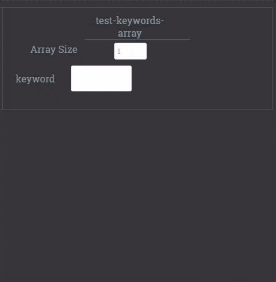

#### 2.3.2 Array of Nested Objects

Using array inputs is especially powerful when used with a defined schema to produce a list of nested objects. This 
example uses an image url and associated title. 


```yaml
properties:
  test-keywords-array:
    type: 'array'
    items:
      title: 'keyword'
      type: 'object'
    title: 'test-keywords-array'
```

The input controls follow the same conventions already defined.


Array inputs are also useful to accept a number of files for instance in the case of multiple slices of the same image.
In this case the input control is a directory upload form.
```yaml
properties:
  test-file-array:
    type: 'array'
    items:
      type: 'string'
      format: 'base64'
      '_mime-type': 'application/octet-stream'
    title: 'test-file-array'
    '_control': 'directory'
```
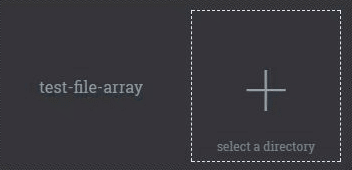

Data from an array input is available in a sub-directory, with each element named by it's index in the array. 
For a string array, a separate string can be read from each individual file which will be named `array-name/0`,
`array-name/1`, `array-name/2`, and so on. Reading data from an array of objects follows all of the above conventions, 
for example `array-name/0/test-int` would contain the value of the `test-int` property of the first element in the 
array named `array-name`.
## 3 Output

Similar to what has been stated above regarding inputs, all outputs defined by your algorithms `com.envoyai.schema-out`
will be supplied via JSON over WebAPI via the 'EnvoyAI Integration API', and one should not be too concerned with the
exact user interface, as it may need to vary system to system, or client to client. However for testing and
demonstration purposes, you can use https://portal.envoyai.com which will dynamically render input and outputs controls for any types.

### 3.1 Simple Outputs

|Type       |In Code              |JSON Schema Property                                                                                    |Screenshot                                      |
|-----------|---------------------|--------------------------------------------------------------------------------------------------------|------------------------------------------------|
|String     |`string`             |`test-string: {type: 'string', title: 'test-string'}`                                                   |        |
|String     |URL &#124; Data URI  |`test-string: {type: 'string', title: 'test-string', format: 'imageSrc'}`                               |        |
|Enum       |`string`             |`test-enum: {type: 'string', 'enum': ['A', 'B', 'C'], title: 'test-enum'}`                              |            |
|DateTime   |ISO-8601             |`test-date: {type: 'string', format: 'date-time', title: 'test-date'}`                                  |    |
|Boolean    |`True` &#124; `False`|`test-bool: {type: 'boolean', title: 'test-bool'}`                                                      |      |
|Integer    |`string`             |`test-integer: {type: 'integer', title: 'test-integer'}`                                                |      |
|Float      |`string`             |`test-float: {type: 'number', title: 'test-float'}`                                                     |          |
|Percentage |ex. `12%` &#124; .12 |`test-percentage: {type: 'number', format: 'percentage', title: 'test-percentage'}`                     ||
|File       |`bytes`              |`test.zip: {type: 'string', format: 'base64', title: 'test.zip', _mime-type: 'application/octet-stream'`|            |
|Image      |`bytes`              |`test.jpg: {type: 'string', format: 'base64', title: 'test.jpg', _mime-type: 'image/jpg'}`              |           |
Writing any of the above inputs to the output directory `/envoyai/output/` directory is straightforward. For example:
```python
test_string = "hello world"
with open('/envoyai/output/test-string','w') as file_out:
    file_out.write(test_string)
```
when using DateTime, Boolean, Integer, Float or Percentage the transformation step to convert from your programming language's data type
to the string that should be written to a file follows a similar pattern as the input example above. Some example code:
```python
from datetime import datetime

# example values
date_value = datetime.now() 
bool_value = False
int_value = 1
float_value = 3.1415926
percentage_value= 0.85

# example strings
date_string = date_value.isoformat()
bool_string = str(bool_value)
int_string = str(int_value)
float_string = str(float_value)
percentage_string = float(percentage_value*100)+'%'

# writing to files
with open('/envoyai/output/test-date','w') as date_out, \
    open('/envoyai/output/test-bool','w') as bool_out, \
    open('/envoyai/output/int-bool','w') as int_out, \
    open('/envoyai/output/float-bool','w') as float_out, \
    open('/envoyai/output/percentage-bool','w') as percentage_out:
    date_out.write(date_string)
    bool_out.write(bool_string)
    int_out.write(int_string)
    float_out.write(float_string)
    percentage_out.write(percentage_string)
```

### 3.2 Nested Object Outputs

Nested object output follows all of the conventions outlined in [Nested Object Input](#22-nested-object-inputs); 
simply create a directory in `/envoyai/output` and put files as property values in the directory.

### 3.3 Array Inputs

Nested object output follows all of the conventions outlined in [Array Input](#23-array-inputs); 
simply create a directory in `/envoyai/output` and put files or directories named by (integer) index with 
files as property values in the directory.
