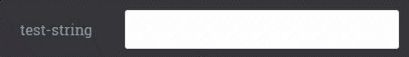
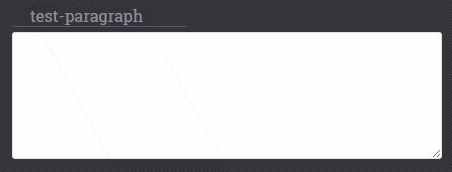
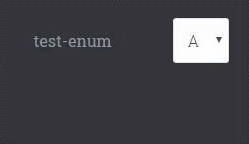
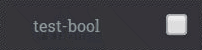
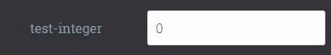
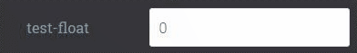
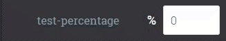
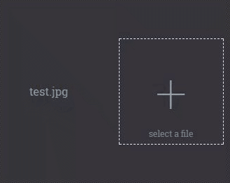
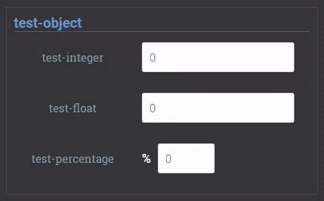
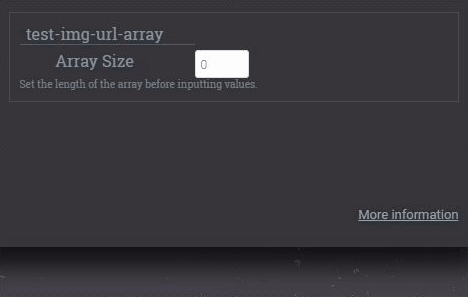

# Echo Example

This example demonstrates each type of input and output parameter and 
how they can be used to gather and display a rich set of data

* [Input Controls](#1-input)
    * [Simple Inputs](#11-simple-inputs)
    * [File Inputs](#12-file-inputs)
        * [Images](#121-images)
    * [Nested Object](#13-nested-object-inputs)
    * [Arrays](#14-array-inputs)
* [Output](#2-output)
    * [Simple Outputs](#21-simple-outputs)
    * [File Outputs](#22-file-outputs)
        * [Images](#221-images)
    * [Nested Object](#23-nested-object-outputs)
    * [Arrays](#24-array-outputs)

##### YAML

First an aside about YAML - Each of the JSON metadata fields (`mccoy.schema_in`,`mccoy.schema_out`,`mccoy.info`)
can be specified with JSON, as they have been in each precceding example, or with YAML (a superset of JSON that 
allows us to drop a lot of the cumbersome symbols). This is useful for this example because our schemas become 
quite lengthy, and the additional readability goes a long way. See test/echo's [Dockerfile](Dockerfile) for examples. 

## 1 Input

In practice, all inputs defined by your algorithms `mccoy.schema_in` will be supplied via JSON over WebAPI via the 
'McCoy Integration API', and one should not be too concerned with the exact user interface, as it may need to vary 
system to system, or client to client. However for testing and demonstration purposes, at https://secure.mccoymed.com 
we dynamically render input controls for any input type.

### 1.1 Simple Inputs

To gather a typical string input, your schema would have the following property

|Type       |In Code|JSON Schema Property                                                               |Screenshot                               |
|-----------|---------------|-----------------------------------------------------------------------------------|-----------------------------------------|
|String     |`string`             |`test-string: {type: 'string', title: 'test-string'}`                              |        |
|Paragraph  |`string`             |`test-paragraph: {type: 'string', title: 'test-paragraph','_control': 'textarea'}` |  |
|Enum       |`string`             |`test-enum: {type: 'string', 'enum': ['A', 'B', 'C'], title: 'test-enum'}`         |            |
|DateTime   |ISO-8601             |`test-date: {type: 'string', format: 'date-time', title: 'test-date'}`             |    |
|Boolean    |`True` &#124; `False`|`test-bool: {type: 'boolean', title: 'test-bool'}`                                 |      |
|Integer    |`string`             |`test-integer: {type: 'integer', title: 'test-integer'}`                           |      |
|Float      |`string`             |`test-float: {type: 'number', title: 'test-float'}`                                |          |
|Percentage |`12%`                |`test-percentage: {type: 'number', format: 'percentage', title: 'test-percentage'}`||

TODO a few code for date enum and maybe percentage

### 1.2 File Inputs

TODO

#### 1.2.1 Images

TODO

### 1.3 Nested Object Inputs

TODO

### 1.4 Array Inputs

TODO

## 2 Output

TODO
