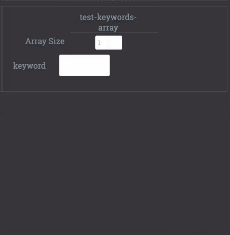
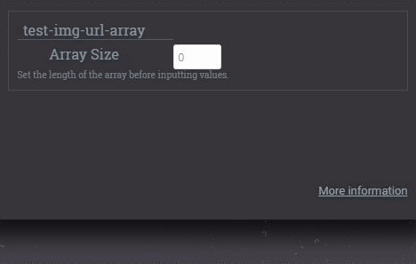
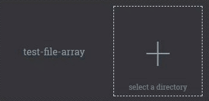

# Echo Example

This example demonstrates each type of input and output parameter and 
how they can be used to gather and display a rich set of data

* [Input Controls](#1-input)
    * [Simple Inputs](#11-simple-inputs)
    * [Nested Object](#12-nested-object-inputs)
    * [Arrays](#13-array-inputs)

##### YAML

First an aside about YAML - Each of the JSON metadata fields (`mccoy.schema_in`,`mccoy.schema_out`,`mccoy.info`)
can be specified with JSON, as they have been in each precceding example, or with YAML (a superset of JSON that 
allows us to drop a lot of the cumbersome symbols). This is useful for this example because our schemas become 
quite lengthy, and the additional readability goes a long way. The one catch is because the way Dockerfile labels
capture strings, one must explicitly insert newlines `\n`. See test/echo's [Dockerfile](Dockerfile) for examples. 


## 1 Input

In practice, all inputs defined by your algorithms `mccoy.schema_in` will be supplied via JSON over WebAPI via the 
'McCoy Integration API', and one should not be too concerned with the exact user interface, as it may need to vary 
system to system, or client to client. However for testing and demonstration purposes, at https://secure.mccoymed.com 
we dynamically render input controls for any input type.

### Files

About working with files - Accepting files as input and writing files as output is very simple.
Despite the fact that the 'McCoy Integration API' can run over Web API where files need to be transcoded to and from
strings, files can be read and written normally, and any concern about transmission can be safely left up to the 
'McCoy Platform'. As a simple demonstration, the code below reads an image and modifies it by adding text. 
The input file `/mccoy/input/image.png` can be read normally, and the `image.png` property of the output will 
automatically assume the value of the file written to `/mccoy/input/image.png`.
```python
from PIL import Image, ImageDraw, ImageFont    
image = Image.open('/mccoy/input/image.png')
draw  = ImageDraw.Draw(image)
font  = ImageFont.truetype('arial.ttf', 20, encoding='unic')
draw.text( (10,10), 'Your Text', fill='#a00000', font=font)
image.save('/mccoy/output/image.png','PNG')
```

### 1.1 Simple Inputs

To gather a typical string input, your schema would have the following property

|Type       |In Code              |JSON Schema Property                                                                                                         |Screenshot                               |
|-----------|---------------------|-----------------------------------------------------------------------------------------------------------------------------|-----------------------------------------|
|String     |`string`             |`test-string: {type: 'string', title: 'test-string'}`                                                                        |        |
|Paragraph  |`string`             |`test-paragraph: {type: 'string', title: 'test-paragraph','_control': 'textarea'}`                                           |  |
|Enum       |`string`             |`test-enum: {type: 'string', 'enum': ['A', 'B', 'C'], title: 'test-enum'}`                                                   |            |
|DateTime   |ISO-8601             |`test-date: {type: 'string', format: 'date-time', title: 'test-date'}`                                                       |    |
|Boolean    |`True` &#124; `False`|`test-bool: {type: 'boolean', title: 'test-bool'}`                                                                           |      |
|Integer    |`string`             |`test-integer: {type: 'integer', title: 'test-integer'}`                                                                     |      |
|Float      |`string`             |`test-float: {type: 'number', title: 'test-float'}`                                                                          |          |
|Percentage |ex. `12%`            |`test-percentage: {type: 'number', format: 'percentage', title: 'test-percentage'}`                                          ||
|File       |`bytes`              |`test.zip: {type: 'string', format: 'base64', title: 'test.zip', _mime-type: 'application/octet-stream', '_control': 'file'}`|            |
|Image      |`bytes`              |`test.jpg: {type: 'string', format: 'base64', title: 'test.jpg', _mime-type: 'image/jpg', '_control': 'file'}`               |           |
Reading any of the above inputs from the provided files in the `/mccoy/input/` directory is strait forward. For example:
```python
with open('/mccoy/input/test-string','r') as file_in:
    test_string = file_in.read()
```
when using DateTime, Boolean, Integer, Float or Percentage the transformation step to convert the string into the
correct data type should be trivial in any programming language. Some example code:
```python
from dateutil import parser as dateutil_parser

# example values
test_date_string = '2017-05-27T03:40:40Z' 
test_bool_string = 'False'
test_integer_string = '1'
test_float_string = '3.1415926'
test_percentage_string = "85%"

# parsing examples
test_date = dateutil_parser.parse(test_date_string)
test_bool = test_bool_string == 'True'
test_integer = int(test_integer_string)
test_float = float(test_float_string)
test_percentage_float = float(test_percentage_string.replace('%', ''))/100.0

```

### 1.2 Nested Object Inputs

Nested objects can be used to organize properties - The input controls will be grouped together.


### 1.3 Array Inputs

Currently there are two specialized array input controls and a general purpose control that can handle any types.

#### 1.3.1 Array of strings input

An array of strings can be defined in the schema by specifying the `type` in the `items` sub-property.
```yaml
properties:
  test-keywords-array:
    type: 'array'
    items:
      title: 'keyword'
      type: 'string'
    title: 'test-keywords-array'
```

Arrays will render multiple inputs very similarly to the named inputs in the [Simple Inputs Table](#11simple-inputs). 
Notice that the array input control requires the user to specify the length of the array first. 



Using array inputs is especially powerful when used with a defined schema to produce a list of nested objects. This 
example uses an image url and associated title. 



Array inputs are also useful to accept a number of files for instance in the case of multiple slices of the same image.
In this case the input control is a directory upload form.
```yaml
properties:
  test-file-array:
    type: 'array'
    items:
      type: 'string'
      format: 'base64'
      '_mime-type': 'application/octet-stream'
    title: 'test-file-array'
    '_control': 'directory'
```

